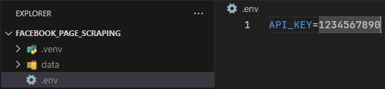
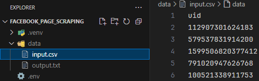

# Dự án trích xuất thông tin facebook page

## Tổng quan
Dự án tập trung vào phát triển phần mềm webscrape thông tin của facebook page dựa theo UID của page.

## Người tham gia
1. Bùi Duy Tân
1. Nguyễn Văn Cương
1. Nguyễn Văn Cường

## Yêu cầu
1. Máy tính được cài đặt `python` và `git`
2. Ít nhất 4 nhân CPU, 8 GB RAM

## Quy trình

### 1. Tải dự án về máy tính
```bash
git clone https://github.com/duytanisme/facebook_page_scraping.git fb_ps
```
Với `fb_ps` là tên thư mục sẽ chứa dự án. Có thể đổi tên thư mục `fb_ps` thành bất kì tên nào cũng được.

Chuyển vị trí vào thư mục chứa dự án.
```bash
cd fb_ps
```

### 2. Cài đặt các thư viện cần thiết

Thực hiện tạo môi trường ảo cho python để tránh xung đột với các thư viện hiện có trong máy.

Đối với Windows:
```bash
python -m venv .venv
.venv/Scripts/activate
pip install -r requirements.txt
```

Đối với Linux:
```bash
python3 -m venv .venv
source .venv/bin/activate
pip install -r requirements.txt
```

### 3. Thiết lập các biến môi trường

Tạo file `.env` ở folder hiện tại, sau đó thêm vào API key của nhà cung cấp proxy. Ví dụ:



### 4. Tạo thư mục chứa các file dữ liệu

Tạo thư mục `data` trong thư mục hiện tại, sau đó thêm vào file `input.csv` với một cột `uid`. Ví dụ:



### 5. Chạy file chính

```bash
python main.py
```

Sau đó, dữ liệu đầu ra sẽ được lưu [tại đây](data/output.txt).
